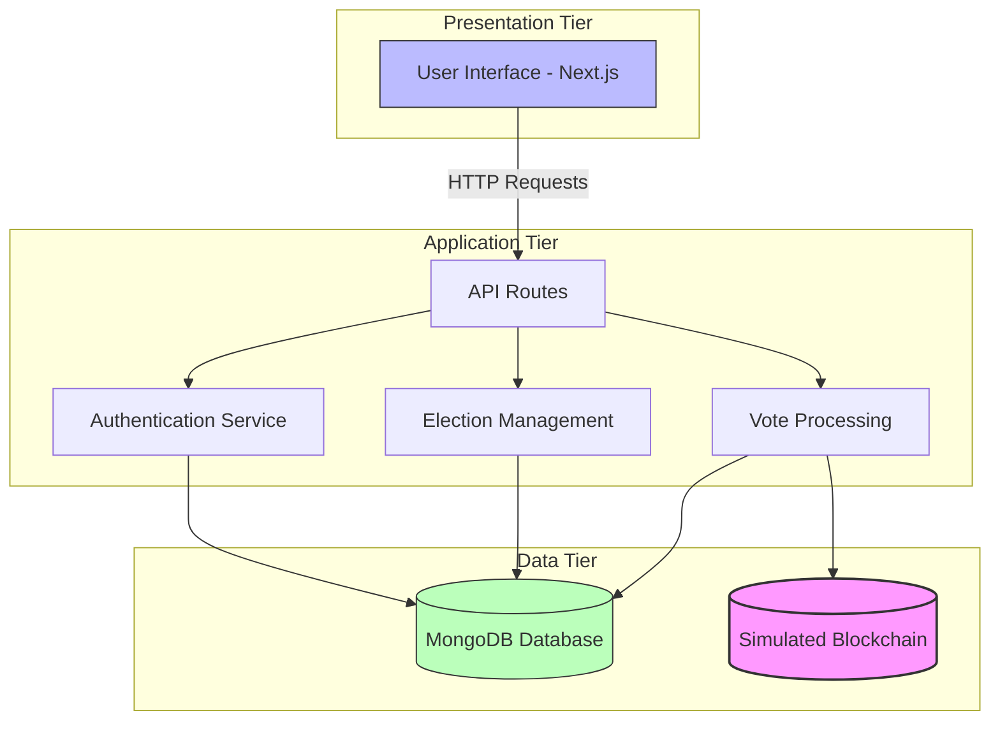
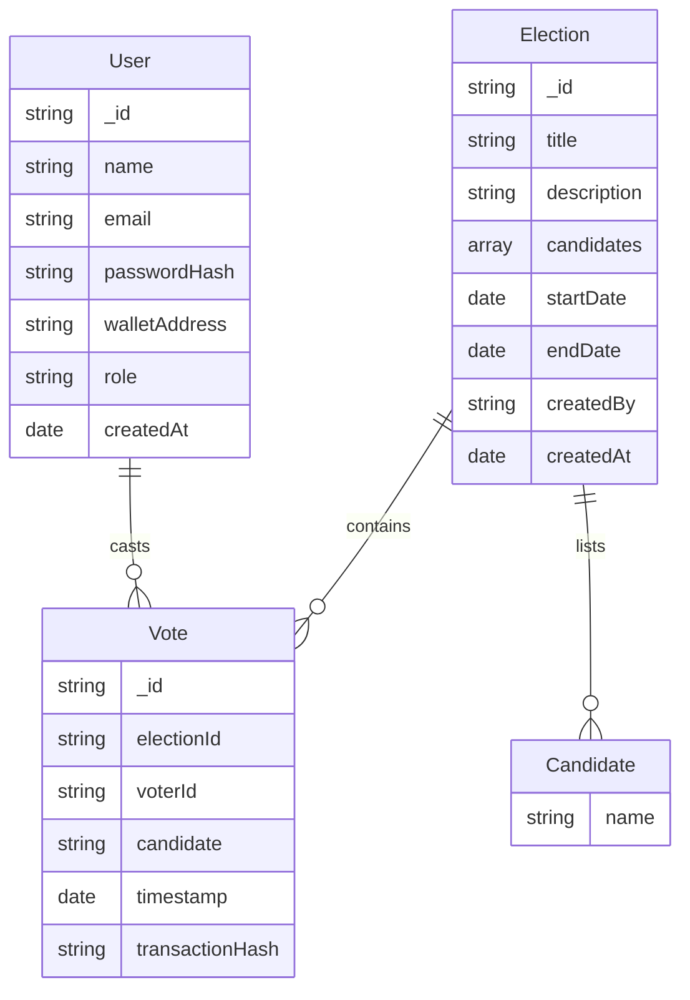
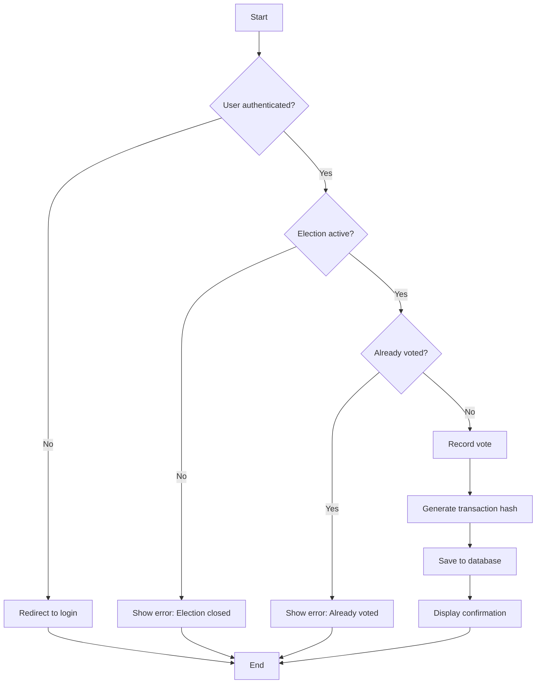
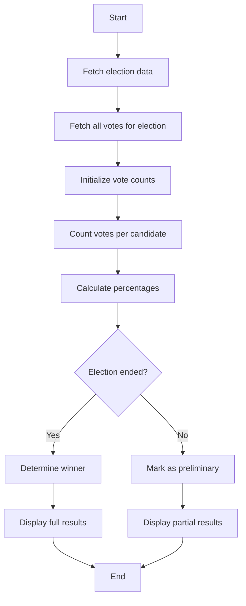
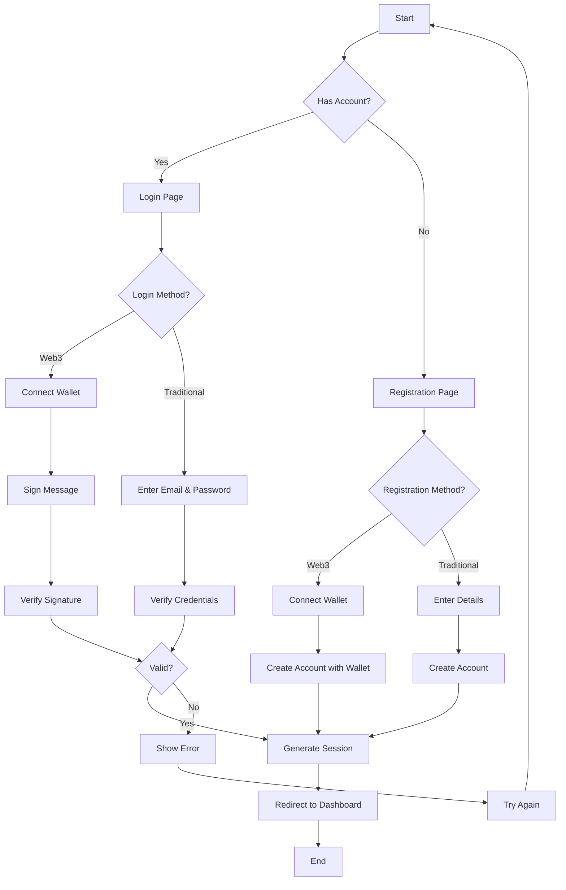
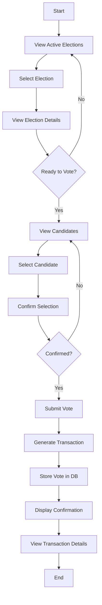
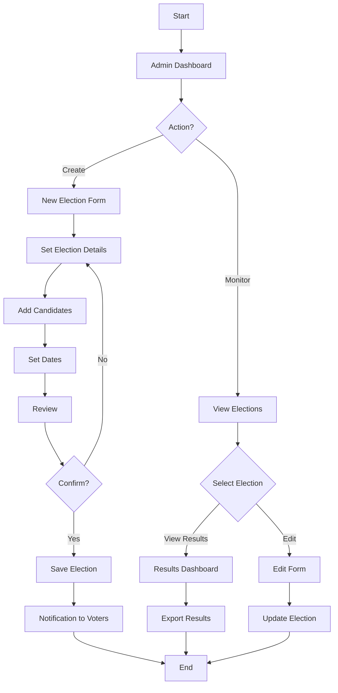

# DECENTRALIZED BLOCKCHAIN-BASED VOTING SYSTEM

## CHAPTER FOUR: SYSTEM DESIGN AND IMPLEMENTATION

### 4.1 Objective of Design

The primary objective of the Decentralized Blockchain-Based Voting System is to create a secure, transparent, and tamper-proof electronic voting platform that leverages blockchain technology. The system aims to:

1. Ensure the integrity and immutability of the voting process
2. Provide transparent yet privacy-preserving vote recording
3. Enable voters to verify their votes without compromising the secrecy of the ballot
4. Eliminate the possibility of double-voting through cryptographic verification
5. Create an auditable trail of voting records that cannot be altered
6. Make the voting process more accessible while maintaining security

### 4.2 System Architecture in Terms of Tiers

The system follows a modern three-tier architecture enhanced with blockchain components:

*Figure 4.1: Three-tier System Architecture*

1. **Presentation Tier**: 
   - Built with Next.js React framework
   - Responsive UI for different device types
   - Client-side functionality for wallet connection
   - Real-time feedback and status indicators

2. **Application Tier**:
   - Next.js API routes for server-side processing
   - Authentication services (traditional and Web3)
   - Election management subsystem
   - Vote processing and verification
   - Blockchain transaction handling

3. **Data Tier**:
   - MongoDB database for structured data storage
   - Simulated blockchain for immutable vote records
   - Transaction hash generation for vote verification

### 4.3 Choice of Programming Environment

The system was developed using the following technologies:

1. **Frontend Development**:
   - **Next.js**: A React framework that enables server-side rendering and static site generation
   - **TypeScript**: For type-safe code and better developer experience
   - **Tailwind CSS**: For responsive and modern UI components

2. **Backend Development**:
   - **Next.js API Routes**: For serverless API endpoints
   - **MongoDB**: For database management
   - **NextAuth.js**: For authentication handling
   - **Crypto**: For cryptographic operations

3. **Blockchain Integration**:
   - **Web3.js**: For blockchain interactions
   - **Wallet connection libraries**: For integrating with cryptocurrency wallets

4. **Development Tools**:
   - **npm**: For package management
   - **Git**: For version control
   - **VS Code**: As the primary IDE

The choice of Next.js enables both frontend and backend to be built within the same codebase, simplifying deployment and management.

### 4.4 Database Structure

The database structure was designed to support both traditional user data and blockchain-related information:

*Figure 4.2: Entity-Relationship Diagram*

The database design focuses on maintaining the relationships between users, elections, and votes while ensuring the integrity of the voting process.

### 4.5 Database Table Definition

#### User Collection
| Field         | Type     | Description                                     |
|---------------|----------|-------------------------------------------------|
| _id           | ObjectId | Unique identifier                               |
| name          | String   | User's full name                                |
| email         | String   | Email address (unique, optional)                |
| passwordHash  | String   | Hashed password (optional)                      |
| walletAddress | String   | Blockchain wallet address (unique, optional)    |
| role          | String   | User role (voter, admin)                        |
| createdAt     | Date     | Account creation timestamp                      |

#### Election Collection
| Field       | Type     | Description                                     |
|-------------|----------|-------------------------------------------------|
| _id         | ObjectId | Unique identifier                               |
| title       | String   | Election title                                  |
| description | String   | Detailed election description                   |
| candidates  | Array    | List of candidate names                         |
| startDate   | Date     | Election start datetime                         |
| endDate     | Date     | Election end datetime                           |
| createdBy   | ObjectId | Reference to the admin who created the election |
| createdAt   | Date     | Creation timestamp                              |

#### Vote Collection
| Field          | Type     | Description                                     |
|----------------|----------|-------------------------------------------------|
| _id            | ObjectId | Unique identifier                               |
| electionId     | ObjectId | Reference to the election                       |
| voterId        | ObjectId | Reference to the voter                          |
| candidate      | String   | Selected candidate's name                       |
| timestamp      | Date     | Vote submission timestamp                       |
| transactionHash| String   | Simulated blockchain transaction hash           |

### 4.6 Input and Output Screen Format

The system features several key screens for user interaction:

1. **Authentication Screens**:
   - Login page with email/password and wallet connection options
   - Registration page for new user account creation

2. **Dashboard**:
   - Overview of active and past elections
   - User's voting history

3. **Election Management**:
   - Election creation form (admin only)
   - Election results view with visual graphs

4. **Voting Interface**:
   - Candidate selection screen
   - Vote confirmation and submission

5. **Blockchain Verification**:
   - Transaction hash display
   - Vote verification screen

### 4.7 Program Algorithm

The key algorithms in the system include:

**Vote Submission Algorithm**:

*Figure 4.3: Vote Submission Algorithm*

**Election Results Calculation Algorithm**:

*Figure 4.4: Election Results Calculation Algorithm*

### 4.8 Program Flowcharts

**User Authentication Flow**:

*Figure 4.5: User Authentication Flow*

**Voting Process Flow**:

*Figure 4.6: Voting Process Flow*

**Election Management Flow (Admin)**:

*Figure 4.7: Election Management Flow*

### 4.9 Hardware Requirements

The minimum hardware requirements for running the system are:

1. **Server**:
   - CPU: 2+ cores
   - RAM: 4GB minimum, 8GB recommended
   - Storage: 20GB SSD
   - Network: Stable internet connection

2. **Client (User)**:
   - Any modern device capable of running a web browser
   - Stable internet connection
   - For Web3 features: Compatible with wallet browser extensions

### 4.10 Software Requirements

The software requirements for the system include:

1. **Server Environment**:
   - Node.js v16.0 or higher
   - npm v7.0 or higher
   - MongoDB v4.4 or higher

2. **Client Environment**:
   - Modern web browser (Chrome, Firefox, Safari, Edge)
   - Optionally: MetaMask or compatible Web3 wallet extension

3. **Development Environment**:
   - Git version control
   - Code editor (VS Code recommended)
   - MongoDB tools for database management

### 4.11 Documentation

The system is documented using the following approach:

1. **Code Documentation**:
   - In-line comments explaining complex logic
   - TypeScript types and interfaces for clearer component interfaces
   - API route documentation with expected inputs and outputs

2. **User Documentation**:
   - Admin guide for election management
   - Voter guide for account creation and voting process
   - Technical guide for system maintenance

3. **Security Documentation**:
   - Authentication flow explanations
   - Blockchain verification process
   - Data protection measures

## CHAPTER FIVE: SUMMARY, CONCLUSION AND RECOMMENDATION

### 5.1 Summary

The Decentralized Blockchain-Based Voting System represents a significant advancement in electronic voting technology. By leveraging blockchain principles for vote recording and verification while maintaining an accessible user interface, the system balances security and usability.

Key features implemented include:
- Dual authentication methods (traditional and Web3)
- Secure vote recording with blockchain transaction hashes
- Comprehensive election management tools
- Real-time results calculation and visualization
- Vote verification through transaction hash lookup

The system addresses common challenges in electronic voting such as transparency, security, and voter verification while providing administrators with powerful management tools.

### 5.2 Conclusion

The development of this system demonstrates the viability of using blockchain concepts to enhance the integrity of voting processes. While the current implementation uses a simulated blockchain approach, it establishes the architectural foundation needed for integration with actual blockchain networks in the future.

The combination of Next.js for the application framework, MongoDB for data storage, and cryptographic techniques for vote verification creates a robust platform that could be adapted for various voting scenarios, from small organizational elections to larger democratic processes.

The user-friendly interface, coupled with detailed documentation, ensures that both voters and administrators can effectively use the system with minimal training, while the underlying technical architecture maintains the security principles necessary for trustworthy digital voting.

### 5.3 Recommendation

Based on the development and testing of this system, the following recommendations are made:

1. **Further Blockchain Integration**:
   - Implement integration with actual blockchain networks like Ethereum or Solana
   - Develop smart contracts for vote recording and verification

2. **Enhanced Security Measures**:
   - Add multi-factor authentication options
   - Implement advanced cryptographic techniques for voter privacy
   - Conduct regular security audits

3. **Scalability Improvements**:
   - Optimize database queries for larger elections
   - Implement sharding for horizontal scaling
   - Add caching mechanisms for high-traffic periods

4. **Feature Enhancements**:
   - Develop mobile applications for increased accessibility
   - Add support for different voting methods (ranked choice, etc.)
   - Implement real-time notifications for voters

5. **Testing and Validation**:
   - Conduct pilot elections with controlled user groups
   - Perform stress testing with simulated high voter turnout
   - Engage cybersecurity experts for penetration testing

By implementing these recommendations, the system could evolve into a fully production-ready solution suitable for deployment across various organizational contexts, from corporate governance to civic elections.
